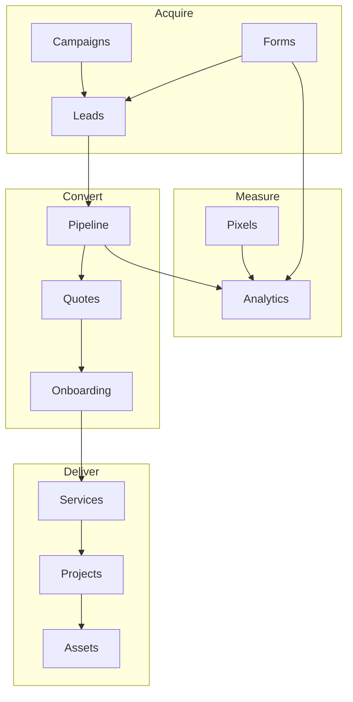

# Section 213 Admin — Page Guide

This document explains the role of every page in the Section 213 admin CRM. Each page is scaffolded today and will be wired to real data, workflows, and analytics in later phases.

**Platform goal:** Give businesses one place to digitalize — from photography and marketing to sponsors, websites, apps, and automations — while managing clients, forms, pixels, and team access.

**Navigation source of truth:** [`src/lib/admin/navigation.ts`](../src/lib/admin/navigation.ts)

---

## Login (public)

| Route | Page | Role |
|-------|------|------|
| `/login` | Admin Sign In | Entry point for staff. Authenticates team members before they access `/admin`. Will connect to Supabase Auth (or similar) with role-based redirects. |

---

## 1. Overview

### Dashboard — `/admin`

**Role:** Command center for the whole platform.

**What it will show:**
- High-level KPIs (revenue, active clients, open leads, projects in progress)
- Recent activity feed (new leads, form submissions, payments, task updates)
- Alerts that need attention (overdue invoices, failed automations, pixel errors)
- Quick actions (create lead, send quote, schedule shoot, open inbox)

**Who uses it:** Owners, managers, and ops staff who need a daily snapshot without drilling into each module.

---

## 2. CRM

Manages the full client lifecycle — from first contact to signed account.

### Clients — `/admin/clients`

**Role:** Master list of active business accounts you are working with or have worked with.

**What it will hold:** Company name, industry, assigned services, account owner, contract status, lifetime value, linked contacts, and open projects.

**Connects to:** Pipeline, Projects, Billing, Communications.

---

### Leads — `/admin/leads`

**Role:** Pre-sale prospects not yet converted to clients.

**What it will hold:** Inbound leads from forms, ads, referrals, and manual entry. Source, score, stage, and assigned rep.

**Connects to:** Forms (submissions), Marketing (campaigns/attribution), Pipeline.

---

### Contacts — `/admin/contacts`

**Role:** Individual people tied to clients or leads (decision-makers, marketing managers, assistants).

**What it will hold:** Name, email, phone, role, company link, communication history.

**Connects to:** Clients, Leads, Communications (inbox), Onboarding.

---

### Pipeline — `/admin/pipeline`

**Role:** Visual deal flow across all services — photography, marketing, digital builds, automations, etc.

**What it will hold:** Kanban or stage-based view: Inquiry → Proposal → Contract → Active → Completed. Deal value, expected close date, service type.

**Connects to:** Leads, Clients, Quotes, Service-specific pages.

---

### Onboarding — `/admin/onboarding`

**Role:** Track new clients moving from signed contract to fully set up.

**What it will hold:** Checklists per service (brand assets collected, pixel installed, kickoff call done, access granted). Progress % and blockers.

**Connects to:** Clients, Forms, Integrations, Projects.

---

## 3. Forms

Captures client intake, questionnaires, and lead data before and during engagement.

### Form Templates — `/admin/forms/templates`

**Role:** Library of reusable forms (intake, discovery, brand questionnaire, post-shoot feedback).

**What it will hold:** Template name, fields, logic, version history, which services use each template.

**Connects to:** Form Builder, Submissions, Analytics (form conversions).

---

### Submissions — `/admin/forms/submissions`

**Role:** Inbox of completed form responses.

**What it will hold:** Submitter info, answers, timestamp, linked lead/client, status (new, reviewed, converted).

**Connects to:** Leads, CRM, Analytics (funnel).

---

### Form Builder — `/admin/forms/builder`

**Role:** Visual editor to create and edit forms without code.

**What it will hold:** Drag-and-drop fields, validation rules, conditional logic, embed codes, and publish state.

**Connects to:** Form Templates, Submissions, Marketing (conversion events on submit).

---

## 4. Services

Section 213 offers many services; these pages manage delivery by vertical.

### Service Catalog — `/admin/services`

**Role:** Single source of truth for everything you sell.

**What it will hold:** Service names, packages, pricing tiers, deliverables, SLAs, and upsell paths (e.g. photography → social → website).

**Connects to:** All service sub-pages, Quotes, Analytics (service performance).

---

### Photography & Media — `/admin/services/photography`

**Role:** Operate photo/video shoots and media production.

**What it will hold:** Shoot bookings, locations, shot lists, raw/final deliverables, revision rounds, photographer assignment.

**Connects to:** Calendar, Assets & Media, Projects, Billing.

---

### Marketing Strategy — `/admin/services/marketing`

**Role:** Plan and execute marketing engagements (content strategy, social, paid media planning).

**What it will hold:** Strategy docs, content calendars, campaign briefs, channel plans, performance reviews.

**Connects to:** Marketing & Pixels section, Campaigns, Analytics (marketing ROI).

---

### Sponsors & Partners — `/admin/services/sponsors`

**Role:** Manage sponsor deals, brand partnerships, and co-marketing.

**What it will hold:** Partner profiles, deal terms, deliverables owed, revenue share, activation dates.

**Connects to:** Clients, Billing, Projects.

---

### Websites & Apps — `/admin/services/digital`

**Role:** Track web and app builds from discovery to launch.

**What it will hold:** Scope, tech stack, milestones, staging URLs, launch checklist, maintenance plans.

**Connects to:** Projects, Tasks, Automations, Integrations.

---

### Automations — `/admin/services/automations`

**Role:** Business workflows, integrations, and bots for clients.

**What it will hold:** Automation recipes (Zapier-style), triggers, connected apps, run logs, error alerts.

**Connects to:** Integrations, Notifications, Analytics.

---

## 5. Projects

Cross-service execution — one client may have photography, marketing, and a website at once.

### All Projects — `/admin/projects`

**Role:** Unified project list regardless of service type.

**What it will hold:** Project name, client, service, status, deadline, team lead, budget.

**Connects to:** Every service page, Tasks, Calendar, Assets.

---

### Tasks — `/admin/projects/tasks`

**Role:** Team task board for internal work.

**What it will hold:** Assignee, due date, priority, linked project/client, comments.

**Connects to:** All Projects, Calendar, Users.

---

### Calendar — `/admin/projects/calendar`

**Role:** Schedule shoots, calls, launches, and deadlines.

**What it will hold:** Team and resource calendar, client-facing milestones, reminders.

**Connects to:** Photography, Digital launches, Onboarding kickoffs.

---

### Assets & Media — `/admin/projects/assets`

**Role:** File library for deliverables and working files.

**What it will hold:** Uploads, galleries, version history, client download links, usage rights.

**Connects to:** Photography, Projects, Clients.

---

## 6. Marketing & Pixels

Tracks how clients are discovered, measured, and retargeted.

### Campaigns — `/admin/marketing/campaigns`

**Role:** Manage paid and organic campaigns per client or for Section 213 itself.

**What it will hold:** Platform (Meta, Google, etc.), budget, creatives, dates, linked pixels, results.

**Connects to:** Pixels, Attribution, Analytics (marketing ROI).

---

### Tracking Pixels — `/admin/marketing/pixels`

**Role:** Install and manage tracking snippets (Meta Pixel, GA4, TikTok, custom).

**What it will hold:** Pixel IDs, domains, install status, snippet code, last fire time.

**Connects to:** Conversion Events, Analytics (pixel data), Integrations.

---

### Conversion Events — `/admin/marketing/events`

**Role:** Define what counts as a conversion and when events fire.

**What it will hold:** Event names (Lead, Purchase, Schedule), mapping to pixels, firing rules on forms/pages.

**Connects to:** Pixels, Form submissions, Analytics.

---

### Attribution — `/admin/marketing/attribution`

**Role:** Credit leads and revenue to the right channel.

**What it will hold:** UTM rules, first/last touch models, channel breakdown per client.

**Connects to:** Leads, Campaigns, Analytics.

---

### Audiences — `/admin/marketing/audiences`

**Role:** Build segments for ads and retargeting.

**What it will hold:** Audience rules (visited site, submitted form, client list sync), export to ad platforms.

**Connects to:** Pixels, Clients, Campaigns.

---

## 7. Analytics

Heavy data analysis across the business — executive and operational views.

### Analytics Overview — `/admin/analytics`

**Role:** Executive dashboard — platform-wide trends in one place.

**What it will show:** Revenue, clients, pipeline, marketing spend, form volume, top services.

**Connects to:** All other analytics sub-pages as drill-downs.

---

### Revenue & Billing — `/admin/analytics/revenue`

**Role:** Financial performance over time.

**What it will show:** MRR, invoice totals, LTV, outstanding AR, revenue by service.

**Connects to:** Billing (invoices, subscriptions), Pipeline.

---

### Client Growth — `/admin/analytics/clients`

**Role:** How the client base is growing or shrinking.

**What it will show:** New clients, churn, retention, cohort analysis, health scores.

**Connects to:** Clients, Leads, Onboarding.

---

### Service Performance — `/admin/analytics/services`

**Role:** Which services sell, deliver, and retain best.

**What it will show:** Conversion by service, project duration, margin, repeat purchase rate.

**Connects to:** Service Catalog, Projects, Revenue.

---

### Marketing ROI — `/admin/analytics/marketing`

**Role:** Is marketing spend paying off?

**What it will show:** Cost per lead, cost per client, ROAS, channel comparison.

**Connects to:** Campaigns, Attribution, Leads.

---

### Form Conversions — `/admin/analytics/forms`

**Role:** Funnel from form view → submit → lead → client.

**What it will show:** Drop-off rates, top templates, time to convert.

**Connects to:** Forms (templates, submissions), Leads.

---

### Pixel & Event Data — `/admin/analytics/pixels`

**Role:** Raw and aggregated event analytics.

**What it will show:** Event volume, trends, anomalies, pixel health diagnostics.

**Connects to:** Pixels, Conversion Events.

---

### Custom Reports — `/admin/analytics/reports`

**Role:** Saved, reusable report definitions.

**What it will hold:** User-built reports, filters, date ranges, shareable links for stakeholders.

**Connects to:** All analytics data sources.

---

### Data Exports — `/admin/analytics/exports`

**Role:** Pull data out for spreadsheets, BI tools, or client reporting.

**What it will hold:** Export jobs (CSV/API), schedules, history.

**Connects to:** Clients, Revenue, Forms, Events.

---

## 8. Communications

Client and team messaging in one place.

### Inbox — `/admin/communications/inbox`

**Role:** Unified message threads with clients and leads.

**What it will hold:** Email/SMS/chat threads, assignment, read state, linked CRM records.

**Connects to:** Contacts, Clients, Leads.

---

### Message Templates — `/admin/communications/templates`

**Role:** Reusable outreach and notification copy.

**What it will hold:** Email/SMS templates with variables (`{{client_name}}`), categories, approval status.

**Connects to:** Inbox, Onboarding, Billing (invoice reminders).

---

### Notifications — `/admin/communications/notifications`

**Role:** System and user alerts inside the admin.

**What it will hold:** New lead alerts, payment received, task assigned, automation failures, preference toggles.

**Connects to:** All modules that emit events.

---

## 9. Billing

Money in — quotes before the sale, invoices and subscriptions after.

### Invoices — `/admin/billing/invoices`

**Role:** Billing history and payment tracking.

**What it will hold:** Invoice line items, status (draft, sent, paid, overdue), Stripe/payment links.

**Connects to:** Clients, Revenue analytics, Communications.

---

### Quotes & Proposals — `/admin/billing/quotes`

**Role:** Pre-sale pricing and proposals.

**What it will hold:** Service packages, custom line items, expiry, client approval, convert-to-invoice.

**Connects to:** Pipeline, Service Catalog, Clients.

---

### Subscriptions — `/admin/billing/subscriptions`

**Role:** Recurring revenue plans (retainers, monthly marketing, hosting).

**What it will hold:** Plan tier, billing cycle, renewal date, MRR contribution.

**Connects to:** Revenue analytics, Clients.

---

## 10. Team & Access

Who can use the admin and what they can do.

### Users — `/admin/team/users`

**Role:** Staff accounts on the platform.

**What it will hold:** Name, email, role, last login, assigned clients/projects.

**Connects to:** Roles, Invitations, Audit Log.

---

### Roles & Permissions — `/admin/team/roles`

**Role:** RBAC — control what each role can see and edit.

**What it will hold:** Roles (Owner, Sales, Creative, Analyst), permission matrix per page/action.

**Connects to:** Users, all admin modules (access gates).

---

### Invitations — `/admin/team/invitations`

**Role:** Invite new team members.

**What it will hold:** Pending invites, role pre-assignment, expiry, resend/revoke.

**Connects to:** Users, Login.

---

### Audit Log — `/admin/team/audit`

**Role:** Compliance and accountability — who changed what.

**What it will hold:** User, action, entity, timestamp, before/after snapshots for sensitive changes.

**Connects to:** Users, Clients, Settings, Billing.

---

## 11. Settings

Platform configuration and personal preferences.

### Integrations — `/admin/settings/integrations`

**Role:** Connect third-party tools.

**What it will hold:** Stripe, Meta, Google Analytics, email provider, storage, webhooks — API keys and connection status.

**Connects to:** Pixels, Automations, Billing, Marketing.

---

### Platform Settings — `/admin/settings/platform`

**Role:** Organization-wide defaults.

**What it will hold:** Company name, logo, timezone, currency, default pipelines, branding for client-facing assets.

**Connects to:** Service Catalog, Forms, Quotes.

---

### My Profile — `/admin/settings/profile`

**Role:** Current user’s personal settings.

**What it will hold:** Display name, avatar, password, notification preferences, default dashboard view.

**Connects to:** Notifications, Users.

---

## Sidebar utilities (not full pages)

| Utility | Role |
|---------|------|
| **Search / Command menu (`Ctrl+K`)** | Jump to any admin page quickly. |
| **Help & Support** | Link to support contact or docs. |
| **Sign out** | End session and return to `/login`. |

---

## How sections work together

---

## Implementation status

| Status | Meaning |
|--------|---------|
| **Scaffolded** | Route, sidebar link, title, and placeholder UI exist. |
| **Planned** | Data models, tables, charts, and auth rules not built yet. |

As features ship, update this guide and [`src/lib/admin/navigation.ts`](../src/lib/admin/navigation.ts) so they stay in sync.
